# Source Stream 🌊

[](https://www.python.org)
[](https://fastapi.tiangolo.com/)
[](https://reactjs.org/)
[](https://vitejs.dev/)
[](https://langchain.com/)
[](https://ai.google.dev/)
[](https://groq.com/)
[](https://qdrant.tech/)
[](LICENSE)
[](https://github.com/ravirai/source-stream/actions/workflows/backend-cicd.yml)
[](https://github.com/ravirai/source-stream/actions/workflows/frontend-cicd.yml)

Source Stream is an enterprise-grade RAG (Retrieval-Augmented Generation) application designed for indexing complex local PDFs, scraping live web documentation, and querying them through a modern chat interface with grounded citations.

The ingestion pipeline is designed with a decoupled, modular architecture adhering to the single responsibility principle.

---

## Architecture

<div align="center">
  
</div>

---

## Project Highlights

- **Recursive website crawling**: Effortlessly scrape and index live documentation domains.
- **Session isolated vector collections**: Multi-tenant data segregation per active session.
- **Gemini embeddings**: 3072-dimensional vector representations for high-fidelity semantic search.
- **Groq answer generation**: Ultra-fast LLM inference utilizing `llama-3.1-8b-instant`.
- **Query intent routing**: Smart static routing to bypass retrieval for conversational pleasantries.
- **Input guardrails**: Real-time prompt injection and toxicity detection before query execution.
- **Groundedness evaluation**: Automated hallucination detection auditing generated responses.
- **Execution Trace**: In-app unified developer diagnostics displaying step-by-step latency and token telemetry.
- **Source citations**: Precise context tracing linking generated claims directly to source document chunks.
- **Modular architecture**: Strictly decoupled frontend (React) and backend (FastAPI) utilizing RESTful endpoints.

---

## 🛠 Project Status & Pipeline Stages

The ingestion pipeline is built in step-by-step modular stages:
1. **Document Loading**: Extracts raw text from plain text files (`.txt`), local PDF documents (`.pdf`), and documentation websites (recursive crawl restricting to same domain).
2. **Text Chunking**: Segments documents into smaller, overlapping chunks using LangChain's `RecursiveCharacterTextSplitter` to fit LLM context limits and retain semantic meaning.
3. **Embeddings & Indexing**: Generates Google Gemini embeddings (`models/gemini-embedding-001`) and indexes chunks in Qdrant Cloud, supporting similarity search.
4. **RAG Core & Chat**: Retrieves relevant document chunks and synthesizes grounded answers using Groq API. Features dynamic relevance evaluation to intelligently distinguish between actual citations and unused retrieved candidates.
5. **Guardrails**: An LLM-as-a-judge layer that intercepts queries to detect prompt injection/toxicity, and evaluates generated answers post-retrieval to prevent hallucinations.
6. **Diagnostics & Telemetry**: Advanced developer workspace featuring a unified split-pane UI that displays a step-by-step pipeline Execution Trace (latency, tokens) alongside precise source Citations in real-time.

---

## 🔄 Architecture Overview

The following flowchart details the end-to-end request lifecycle during query execution.


---

## Tech Stack

| Category | Technologies |
|---|---|
| **Backend Framework** | FastAPI |
| **Frontend Framework** | Vite, React (JS), Tailwind CSS v3, PostCSS |
| **AI Orchestration** | LangChain (`langchain-text-splitters`, `langchain-google-genai`, `langchain-qdrant`) |
| **Large Language Model** | Groq API (`llama-3.1-8b-instant`) |
| **Embeddings** | Google Gemini API (`models/gemini-embedding-001`) |
| **Vector Database** | Qdrant Cloud |
| **Document Parsing** | BeautifulSoup4, `lxml`, `pypdf` |
| **Package Management** | `uv` (Python), `npm` (Node) |

---

## ⚙️ CI/CD Pipeline

Source Stream features fully automated deployment pipelines orchestrated via **GitHub Actions**. Due to the decoupled architecture, the frontend and backend are deployed completely independently.

- **Backend Pipeline**: Validates Python code using `pytest`. Automatically builds and deploys a new containerized FastAPI revision to Google Cloud Run using zero-trust Workload Identity Federation.
- **Frontend Pipeline**: Validates the React application via `npm run build`. Automatically deploys the static Vite bundle to the global Firebase Hosting CDN.

For a detailed breakdown of triggers, failure scenarios, and rollback procedures, refer to [15-ci-cd.md](docs/15-ci-cd.md).

---

## 📂 Repository Structure

- `backend/`: FastAPI application. Contains API routes, Pydantic schemas, and the decoupled RAG services (document loaders, text splitters, vector stores, and LLM orchestration).
- `frontend/`: React + Vite application. Contains the interactive, responsive user interface including the pipeline visualizer, chat interface, and telemetry split-pane.
- `docs/`: Comprehensive technical documentation, architecture specifications, API references, and Mermaid diagrams.
- `tests/`: Automated unit tests covering pipeline functionality, ensuring reliable retrieval and generation execution.

---

## Getting Started

### Prerequisites
- Python >= 3.11
- Node.js >= 18
- `uv` (Fast Python package manager)

### Installation

1. **Clone the repository.**
2. **Initialize backend environment and install dependencies:**
   ```bash
   cd backend
   uv venv
   uv pip install -r requirements.txt
   ```
3. **Initialize frontend environment and install dependencies:**
   ```bash
   cd frontend
   npm install
   ```

### Running the Application

1. **Start the backend server:**
   ```bash
   cd backend
   PYTHONPATH=. uv run uvicorn app.main:app --reload --port 8000
   ```
2. **Start the frontend client:**
   ```bash
   cd frontend
   npm run dev
   ```
3. Open `http://localhost:5173/` in your browser.

---

## 🔌 API Endpoints

For a detailed spec of endpoints, parameters, and models, refer to `docs/06-api.md`.

### Document Loader
- `POST /api/v1/document-loader/text` - Load a `.txt` file and get raw text.
- `POST /api/v1/document-loader/pdf` - Load a `.pdf` file page-by-page.
- `POST /api/v1/document-loader/website` - Crawl a URL up to a maximum depth.

### Text Splitter
- `POST /api/v1/text-splitter/split` - Split loaded documents into chunks based on `chunk_size` and `chunk_overlap`.

### Vector Store
- `POST /api/v1/vector-store/index` - Generate embeddings and index document chunks into Qdrant.
- `POST /api/v1/vector-store/search` - Perform a similarity search query and return matching chunks.
- `GET /api/v1/vector-store/status` - Retrieve Qdrant collection status, size, and points counts.
- `POST /api/v1/vector-store/clear` - Reset collection parameters (empty index).

### Retriever
- `POST /api/v1/retriever/query` - Context-grounded RAG query answering using Qdrant search and Groq synthesis.

---

## ☁️ Deployment

### Backend (Google Cloud Run)
The backend is packaged using a Dockerfile. To deploy:
1. Ensure the Google Cloud CLI (`gcloud`) is installed and authenticated.
2. Provide necessary environment variables during deployment (`GEMINI_API_KEY`, `GROQ_API_KEY`, `QDRANT_URL`, `QDRANT_API_KEY`).
3. Deploy the service to Cloud Run.

### Frontend (Firebase Hosting)
The frontend utilizes Firebase Hosting and relies on Cloud Run rewrites for API traffic.
1. Build the production application (`npm run build`).
2. Replace `"your-firebase-project-id"` in `frontend/.firebaserc` with your actual Firebase project ID.
3. Run `firebase deploy`. Traffic matching `/api/**` is seamlessly proxied to the deployed backend.

---

## 🧪 Running Tests

Verify the backend modules using `pytest`:
```bash
cd backend
PYTHONPATH=. uv run pytest
```
