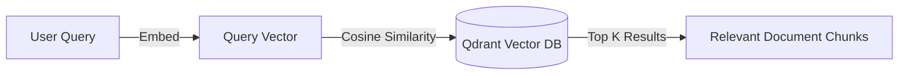

# Vector Store & Embeddings

This document explains the mechanism of translating text into searchable mathematics within `source-stream`.

**Question:** How are chunks converted to embeddings and queried?

## The Embedding Process

When documents are split into chunks by the Text Splitter, they are raw strings. To perform semantic search (finding text based on meaning, rather than exact keyword matches), we must convert these strings into high-dimensional vectors.

`source-stream` uses Google's `models/gemini-embedding-001`.
1. The backend batches the document chunks.
2. The chunks are sent to the Gemini API via LangChain's `GoogleGenerativeAIEmbeddings`.
3. Gemini returns a 768-dimensional float array for each chunk.

## Indexing into Qdrant

The chunks, their metadata (source, page number, chunk index), and their 768-dimensional vectors are upserted into Qdrant Cloud. 

To prevent duplicate data when a user re-indexes the same documents, the `VectorStoreService` implements a `clear_collection` check before indexing. It verifies if the collection exists, deletes the existing vectors, and re-indexes the fresh chunks.

## Semantic Search (Approximate Nearest Neighbor)

During a query, the user's text string is converted into a single vector using the exact same Gemini model.

The Qdrant database then performs an Approximate Nearest Neighbor (ANN) search using the HNSW (Hierarchical Navigable Small World) algorithm. It calculates the Cosine Similarity between the query vector and all chunk vectors in the collection.

The system retrieves the top `K` results (default `K=4`), returning both the underlying text and a `score` (e.g., `0.76` representing a 76% cosine similarity match). These scores are dynamically injected into the chunk metadata so they can be surfaced in the frontend UI's Citations panel.

## Cross-References
- To see how these retrieved chunks are utilized, refer to [07-retrieval-pipeline.md](07-retrieval-pipeline.md).
- To understand why Qdrant and Gemini were selected, refer to [05-design-decisions.md](05-design-decisions.md).
