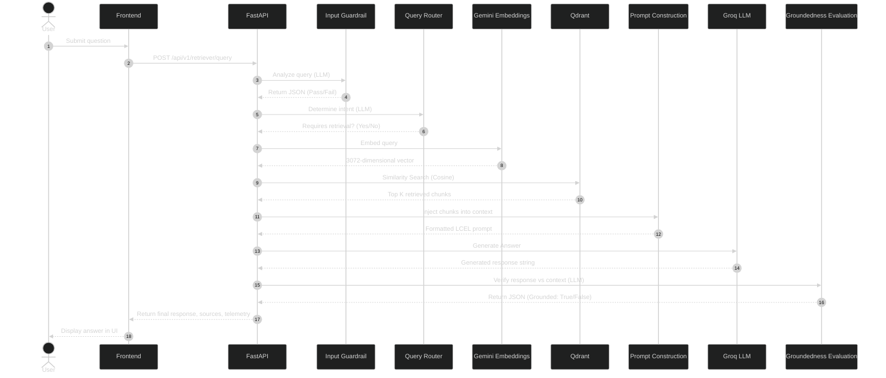

# 12. Request Lifecycle

## 1. Purpose of this Document

This document describes the runtime execution flow of a single user request in the Source Stream RAG application. It details the journey of a question from the moment it is submitted by the user in the frontend until the final grounded response is delivered. It is designed to provide a comprehensive, end-to-end architectural understanding suitable for system design reviews, without requiring direct source code examination.

## 2. High Level Request Lifecycle

## 3. Step by Step Request Flow

### Step 1: Query Ingestion
- **What component is executing**: `api.routes.retriever`
- **Why this step exists**: To receive the HTTP POST request containing the user's natural language query and session ID.
- **Input**: User string (e.g., "What is LangChain?") and `X-Session-Id`.
- **Output**: Validated Pydantic schema request.
- **Whether an external API is called**: No
- **Whether an LLM is involved**: No
- **Which service is responsible**: FastAPI Route Handler
- **What happens next**: The query is passed to the Retrieval/RAG service for execution.

### Step 2: Input Guardrail
- **What component is executing**: `GuardrailService`
- **Why this step exists**: To block prompt injection attacks, toxicity, or completely out-of-scope system instructions before they consume further pipeline resources.
- **Input**: User string.
- **Output**: JSON object containing a boolean decision and reason.
- **Whether an external API is called**: Yes (Groq)
- **Whether an LLM is involved**: Yes
- **Which model is used**: Llama 3.1 8B
- **Which service is responsible**: `GuardrailService.evaluate_input`
- **What happens next**: If blocked, execution halts immediately and an error is returned. If passed, execution proceeds to the Router.

### Step 3: Query Intent Router
- **What component is executing**: `RouterService`
- **Why this step exists**: To determine if the question actually requires database retrieval, or if it is a generic greeting/conversational input that can be handled statically.
- **Input**: User string.
- **Output**: Routing decision string (e.g., `requires_retrieval: true`).
- **Whether an external API is called**: Yes (Groq)
- **Whether an LLM is involved**: Yes
- **Which model is used**: Llama 3.1 8B
- **Which service is responsible**: `RouterService.route_query`
- **What happens next**: If retrieval is not required, a canned response is generated. Otherwise, execution proceeds to embedding.

### Step 4: Query Embedding
- **What component is executing**: `EmbeddingsService`
- **Why this step exists**: To convert the text query into a numerical vector representation so it can be compared mathematically against indexed documents.
- **Input**: User string.
- **Output**: 3072-dimensional float array.
- **Whether an external API is called**: Yes (Google Gemini)
- **Whether an LLM is involved**: Yes
- **Which model is used**: `models/gemini-embedding-001`
- **Which service is responsible**: `EmbeddingsService.embed_query`
- **What happens next**: The vector is sent to Qdrant.

### Step 5: Similarity Search
- **What component is executing**: `VectorStoreService`
- **Why this step exists**: To find the document chunks that are semantically closest to the user's question.
- **Input**: 3072-dimensional vector.
- **Output**: Top K `Document` objects with similarity scores.
- **Whether an external API is called**: Yes (Qdrant Cloud)
- **Whether an LLM is involved**: No
- **Which service is responsible**: `VectorStoreService.similarity_search`
- **What happens next**: The retrieved chunks are filtered and passed to Prompt Construction.

### Step 6: Prompt Construction
- **What component is executing**: `RagChainService` (via LangChain Expression Language)
- **Why this step exists**: To build a strict instruction prompt that forces the LLM to answer *only* using the provided chunks.
- **Input**: User string and formatted context chunks.
- **Output**: Fully compiled string prompt.
- **Whether an external API is called**: No
- **Whether an LLM is involved**: No
- **Which service is responsible**: `RagChainService.build_prompt`
- **What happens next**: The constructed prompt is sent to the LLM.

### Step 7: Answer Generation
- **What component is executing**: `LLMService`
- **Why this step exists**: To synthesize a natural language answer based exclusively on the provided context.
- **Input**: Constructed prompt.
- **Output**: Generated text string.
- **Whether an external API is called**: Yes (Groq)
- **Whether an LLM is involved**: Yes
- **Which model is used**: Llama 3.1 8B
- **Which service is responsible**: `LLMService.generate_response`
- **What happens next**: The generated answer is sent to the final guardrail.

### Step 8: Groundedness Evaluation
- **What component is executing**: `GuardrailService`
- **Why this step exists**: To act as a post-generation safeguard, verifying that the generated answer does not contain hallucinated facts absent from the original context.
- **Input**: User query, retrieved context, and generated answer.
- **Output**: JSON object (Grounded: true/false).
- **Whether an external API is called**: Yes (Groq)
- **Whether an LLM is involved**: Yes
- **Which model is used**: Llama 3.1 8B
- **Which service is responsible**: `GuardrailService.evaluate_groundedness`
- **What happens next**: If grounded, the response is delivered to the user. If ungrounded, a fallback message is returned.

## 4. Detailed explanation of every external API call

### Groq Call #1: Input Guardrail
- **Purpose**: Prevent toxic queries or system prompt injection.
- **Prompt**: A strict zero-shot classification prompt instructing the model to evaluate the input against safety guidelines.
- **Expected JSON output**: `{"is_safe": true, "reason": "Standard technical query"}`
- **Why an LLM is used**: Regex or keyword matching is insufficient for detecting sophisticated prompt injections or complex semantic toxicity.

### Groq Call #2: Query Intent Router
- **Purpose**: Save backend compute and reduce latency by skipping retrieval for conversational inputs.
- **Prompt**: A classification prompt deciding between `retrieval` and `general`.
- **Example output**: `{"intent": "retrieval", "confidence": 0.95}`
- **Why this decision is useful**: Prevents the vector database from executing expensive distance calculations for inputs like "Hello".

### Gemini Embedding API
- **Purpose**: Translates natural language into a dense vector space.
- **What a 3072-dimensional vector represents**: A point in a 3072-dimensional coordinate system where semantically related concepts are positioned closer together mathematically.
- **Why embeddings are used instead of keyword search**: Keyword search (BM25) only finds exact string matches. Embeddings understand synonyms, context, and semantic meaning (e.g., matching "compute cluster" with "server farm").

### Qdrant Similarity Search
- **Purpose**: Retrieves context chunks matching the user's intent.
- **Cosine Similarity**: A mathematical metric measuring the cosine of the angle between two multi-dimensional vectors. A score closer to 1.0 indicates high semantic similarity regardless of magnitude.
- **Top K Retrieval**: Returning only the `K` (e.g., 4) closest vectors to ensure the LLM context window is not overwhelmed with irrelevant or noisy data.
- **Why no LLM is involved**: This is purely an optimized mathematical sorting operation performed on an HNSW (Hierarchical Navigable Small World) index.

### Groq Call #3: Answer Generation
- **Purpose**: Draft the user-facing response.
- **Prompt Construction**: Uses LCEL to inject the concatenated chunk text into a strict template alongside the user's question.
- **Retrieved Context**: The raw text extracted from the Top K vectors, prepended to the instruction layer.
- **Why the LLM is instructed not to hallucinate**: Without strict boundaries, LLMs rely on their parametric memory to fill knowledge gaps. The prompt forces it to output "I don't know" if the context lacks the answer.

### Groq Call #4: Groundedness Evaluation
- **Purpose**: Post-hoc verification of the synthesized answer.
- **Why another LLM evaluates the generated answer**: It serves as an independent auditor. An LLM tasked solely with fact-checking is less prone to generating hallucinations than an LLM tasked with creative synthesis.
- **Hallucination Detection**: The prompt strictly instructs the auditor to flag any factual claim in the answer that cannot be explicitly traced back to the provided context chunks.

## 5. Complete Request Timeline

1. **T=0ms**: Request received by FastAPI.
2. **T+10ms**: Groq Call #1 (Input Guardrail) initiated.
3. **T+45ms**: Guardrail passes. Groq Call #2 (Router) initiated.
4. **T+80ms**: Router dictates retrieval. Gemini Embedding initiated.
5. **T+200ms**: Query vector returned. Qdrant Search initiated.
6. **T+285ms**: Top K chunks retrieved. Prompt constructed.
7. **T+290ms**: Groq Call #3 (Generation) initiated.
8. **T+1100ms**: Response generated. Groq Call #4 (Evaluation) initiated.
9. **T+1300ms**: Evaluation passes.
10. **T+1310ms**: Final response and telemetry dispatched to Frontend.

*(Note: Latency metrics are approximate and depend heavily on network conditions and Groq/Gemini API load.)*

## 6. External Services Used During One Request

| Service | Purpose | Model | Called How Many Times |
|---|---|---|---|
| Groq | Fast LLM Inference (Guardrails, Routing, Generation) | Llama 3.1 8B | 4 times per request |
| Google Gemini | Query Embedding | gemini-embedding-001 | 1 time per request |
| Qdrant Cloud | Vector Similarity Search | N/A | 1 time per request |

## 7. End-to-End Example

**Example Question**: *"What is LangChain?"*

1. **Frontend**: The user types *"What is LangChain?"* and clicks send.
2. **FastAPI**: Receives `{"query": "What is LangChain?"}`.
3. **Input Guardrail**: Groq evaluates *"What is LangChain?"*. Determines it is a safe, technical query. Returns `{"is_safe": true}`.
4. **Query Router**: Groq evaluates intent. Determines the user is asking for factual information. Returns `{"intent": "retrieval"}`.
5. **Gemini Embedding**: Converts *"What is LangChain?"* into `[-0.012, 0.441, ...]` (3072 floats).
6. **Qdrant**: Executes cosine similarity search against the session collection. Finds 4 chunks mentioning LangChain orchestration.
7. **Prompt Construction**: Compiles: *"Context: [LangChain is a framework...]. Question: What is LangChain?"*
8. **Answer Generation**: Groq generates *"LangChain is a framework for developing applications powered by language models."*
9. **Groundedness Evaluation**: Groq cross-references the answer against the chunks. Confirms the answer is factually supported. Returns `{"is_grounded": true}`.
10. **Frontend**: Renders the text response alongside execution trace telemetry and citation links.

## 8. Still have Questions? 🤔

### Explanations.

**Why use embeddings?**
Embeddings capture the semantic meaning of text mathematically, allowing us to find related concepts even if the exact keywords do not match.

**Why use Qdrant?**
Qdrant provides extremely fast similarity search across high-dimensional vectors using HNSW indexing, which is highly efficient and scalable for RAG pipelines.

**Why is there a Query Router?**
To avoid wasting API tokens and adding latency by querying the vector database for conversational pleasantries (e.g., "Hi") that don't require external knowledge.

**Why use two guardrails?**
The first guardrail protects the system from malicious input (prompt injection) *before* processing begins. The second guardrail protects the user from hallucinatory output *after* generation.

**How many LLM calls happen during one request?**
Four distinct calls occur: Input Guardrail, Query Router, Answer Generation, and Groundedness Evaluation. We leverage Groq's high-speed inference to execute all four within an acceptable latency budget.

**Why does Prompt Construction happen before Answer Generation?**
The LLM requires the retrieved context to be injected into its instruction set (the prompt) before it begins synthesizing the answer. The prompt defines the strict boundary conditions for the model.

## 9. Engineering Notes

### Embedding Initialization Lifecycle
During early iterations, `VectorStoreService` initialized the `QdrantVectorStore` client by dynamically determining the embedding dimension size via an active API call (`embeddings.embed_query("test")`) on every request. While this guaranteed correct database configurations across different model paradigms, it added unnecessary latency.

**Current Optimization:**
The embedding dimension size is now statically cached at the class level (`_cached_vector_size`) upon application startup or during the first request. This removes one redundant external Gemini API call from all subsequent similarity searches, significantly reducing pipeline execution time and conserving external API quotas.

**Future Considerations:**
- **Client Connection Pooling**: Reusing initialized Qdrant and Groq HTTP clients across the FastAPI worker lifecycle rather than instantiating them per request.
- **Concurrent Guardrails**: Running the Query Router and the Input Guardrail asynchronously in parallel, as they do not depend on one another.
