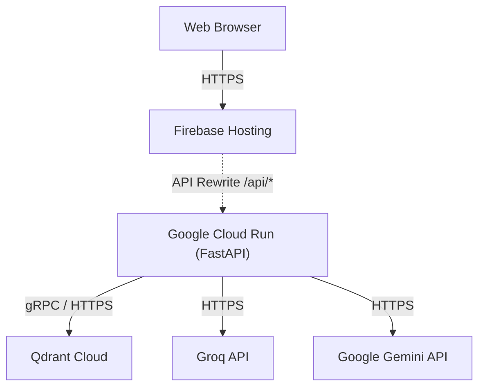

# Deployment

This document explains the production deployment architecture for `source-stream`.

**Question:** How is the application deployed to production?

## Architecture Overview

`source-stream` is designed for a serverless, decoupled cloud deployment model. 
- **Backend:** Deployed as a containerized FastAPI application on Google Cloud Run.
- **Frontend:** Deployed as static assets on Firebase Hosting.
- **Data Stores:** Qdrant Cloud (Vector DB) and external LLM APIs (Groq, Gemini).



## Backend (Google Cloud Run)

We use Cloud Run because it scales automatically to zero when there is no traffic and can scale horizontally to handle massive parallel ingestion or query loads.

### First Time Deployment

When deploying the backend for the very first time, you must supply all required API keys to the container environment:

```bash
cd backend
gcloud run deploy source-stream-backend \
  --source . \
  --region europe-west1 \
  --allow-unauthenticated \
  --set-env-vars="GEMINI_API_KEY=your_key,GROQ_API_KEY=your_key,QDRANT_URL=your_url,QDRANT_API_KEY=your_key"
```

### Deploying Updates (Manual Fallback)

> ⚠️ **Note:** Routine updates are now handled automatically by [GitHub Actions CI/CD](20-ci-cd.md). The following manual steps should only be used as an emergency fallback or for deploying from a local testing branch.

To push a new version to an existing deployment manually, you don't need to re-enter environment variables—Cloud Run will automatically inherit them:

1. **Deploy the backend** from source:
   ```bash
   cd backend
   gcloud run deploy source-stream-backend --source . --region europe-west1
   ```

**Tradeoff Note:** Cloud Run instances are stateless. Any local files loaded via the Document Loader must be processed and embedded into Qdrant within the lifecycle of the request, as the container disk is ephemeral.

## Frontend (Firebase Hosting)

Firebase Hosting provides a global CDN for the React SPA. 

### First Time Deployment

For a brand new Firebase project, ensure you have logged in and selected your project ID:

1. Log into Firebase CLI and initialize (if not already done):
   ```bash
   npm install -g firebase-tools
   firebase login
   ```
2. Set your active project in `frontend/.firebaserc` or run:
   ```bash
   firebase use --add your_firebase_project_id
   ```
3. Build and deploy:
   ```bash
   cd frontend
   npm run build
   firebase deploy --only hosting
   ```

### Deploying Updates (Manual Fallback)

> ⚠️ **Note:** Routine updates are now handled automatically by [GitHub Actions CI/CD](20-ci-cd.md). The following manual steps should only be used as an emergency fallback.

When pushing UI updates to an existing project manually:

1. Build the production application bundle:
   ```bash
   cd frontend
   npm run build
   ```
2. Deploy the static assets and rules:
   ```bash
   firebase deploy --only hosting
   ```

### API Rewrites
Instead of hardcoding the Cloud Run URL in the frontend code, we utilize Firebase `rewrites` in `firebase.json`:
```json
"rewrites": [
  {
    "source": "/api/**",
    "run": {
      "serviceId": "source-stream-backend",
      "region": "europe-west1"
    }
  }
]
```
This ensures that all API calls to `/api/v1/...` bypass CORS restrictions, as the browser treats the backend as being on the same origin.

## ⚙️ Automated CI/CD Pipeline

**Production deployments are now fully automated via GitHub Actions.** 

You should **not** need to manually run `gcloud run deploy` or `firebase deploy` from your local terminal for routine updates. Pushing code to the `main` branch will automatically trigger the respective decoupled deployment pipelines.

For a comprehensive breakdown of the GitHub Actions orchestration, trigger conditions, secrets management, and automated rollback strategies, please read the dedicated [20-ci-cd.md](20-ci-cd.md) architecture document.

## Cross-References
- For local setup instructions, see [README.md](../README.md).
- To troubleshoot deployment connection issues, see [17-troubleshooting.md](17-troubleshooting.md).
