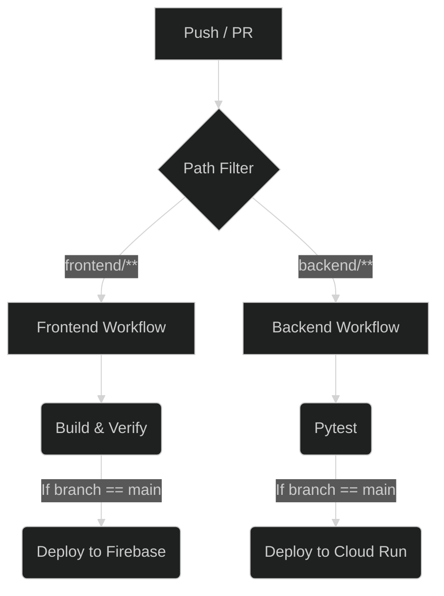
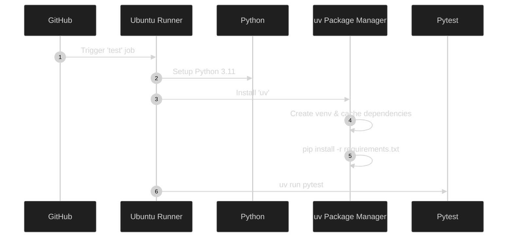
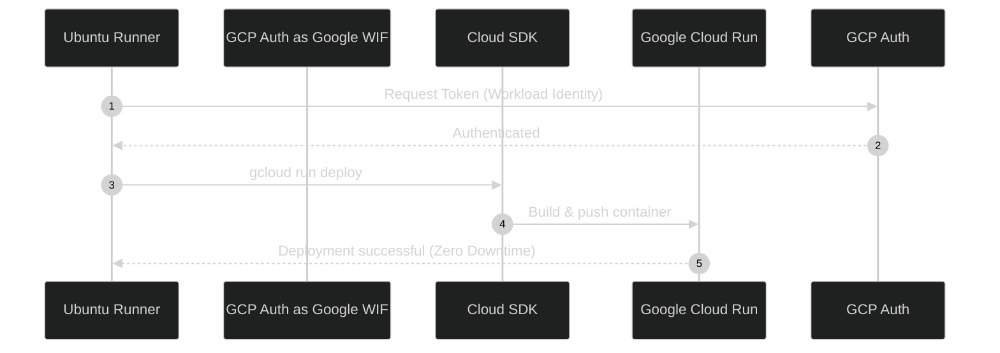
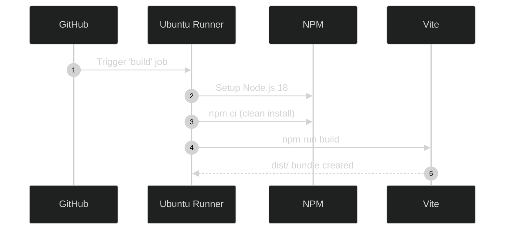
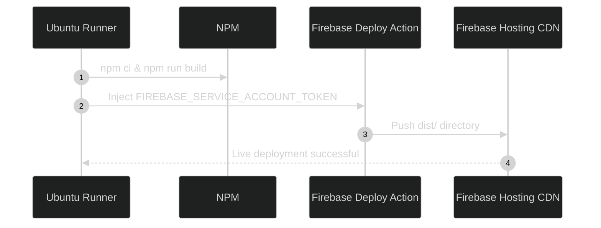

# 15. CI/CD Architecture

This document outlines the Continuous Integration (CI) and Continuous Deployment (CD) pipelines implemented for the `source-stream` project.

## Why GitHub Actions?

GitHub Actions was selected as the CI/CD orchestrator for the following reasons:
1. **Native Integration**: Since the source code is hosted on GitHub, Actions eliminates the need for third-party webhooks or external CI servers (like Jenkins or CircleCI).
2. **Decoupled Workflows**: It allows configuring entirely separate workflows triggered by path-based filtering (e.g., changes exclusively in `backend/` vs `frontend/`).
3. **Ecosystem**: Robust community actions exist for both Google Cloud authentication (`google-github-actions/auth`) and Firebase deployments (`FirebaseExtended/action-hosting-deploy`).

## CI vs CD

- **Continuous Integration (CI)**: Focuses on early detection of integration bugs. Every pull request or push triggers automated steps to install dependencies, run linters, build the application bundle, and execute the test suite (e.g., `pytest`). If CI fails, the code cannot be merged or deployed.
- **Continuous Deployment (CD)**: Automates the delivery of validated code to production. Once the CI pipeline passes on the `main` branch, the CD pipeline securely authenticates with cloud providers and pushes the final artifacts (Docker containers to Cloud Run, static files to Firebase).

---

## Workflow Architecture

Because `source-stream` features a decoupled frontend and backend, the pipelines are strictly independent. A change to a React component will not trigger a Python test suite or a Cloud Run deployment.

---

## Backend CI/CD Workflow

The backend workflow (`backend-cicd.yml`) orchestrates the FastAPI application's journey to Google Cloud Run.

### Trigger Conditions
- **Push** to `main` modifying `backend/**`
- **Pull Request** targeting `main` modifying `backend/**`

### Build Pipeline (Test)

### Deployment Pipeline

---

## Frontend CI/CD Workflow

The frontend workflow (`frontend-cicd.yml`) handles the Vite/React application deployment to Firebase Hosting.

### Trigger Conditions
- **Push** to `main` modifying `frontend/**`
- **Pull Request** targeting `main` modifying `frontend/**`

### Build Pipeline

### Deployment Pipeline

---

## Secrets Management

Security is a primary concern in the deployment pipeline. API keys are **never** hardcoded.

1. **Google Cloud Run (Backend)**: Uses **Workload Identity Federation (WIF)**. Instead of storing a long-lived JSON service account key, GitHub securely requests a short-lived OIDC token from Google using the repository's identity. 
   - Required Secrets: `GCP_WORKLOAD_IDENTITY_PROVIDER`, `GCP_SERVICE_ACCOUNT`
2. **Firebase (Frontend)**: Uses a standard Firebase Service Account token securely injected into the deployment action.
   - Required Secrets: `FIREBASE_SERVICE_ACCOUNT`

> *Note: Runtime secrets (like `GEMINI_API_KEY` and `GROQ_API_KEY`) are stored natively in Google Cloud Secret Manager or Cloud Run environment variables and are NOT exposed to GitHub Actions.*

---

## Failure Scenarios

- **PR Test Failure**: If `pytest` fails on a Pull Request, GitHub prevents merging the PR.
- **Main Test Failure**: If tests fail after merging to `main`, the `deploy` jobs will **not** execute. The live production application remains completely unaffected.
- **Deployment Failure**: If `gcloud run deploy` fails (e.g., due to a bad container build), Cloud Run aborts the traffic migration, leaving the previous stable revision serving 100% of user traffic.

## Rollback Strategy

1. **Backend**: Navigate to the Google Cloud Run console, select the "Revisions" tab, and click "Manage Traffic". Allocate 100% of traffic back to the previous known-good revision.
2. **Frontend**: Navigate to the Firebase Console -> Hosting. Hover over the previous successful deployment in the Release History table and click "Rollback".

## Future Improvements

- **End-to-End (E2E) Testing**: Introduce Playwright or Cypress tests to validate the frontend and backend interact correctly before deploying to production.
- **Staging Environments**: Automatically spin up preview URL environments for both Cloud Run and Firebase when a PR is created, tearing them down when the PR is closed.
- **Semantic Release**: Automate version bumping and GitHub Release tagging based on conventional commit messages.
