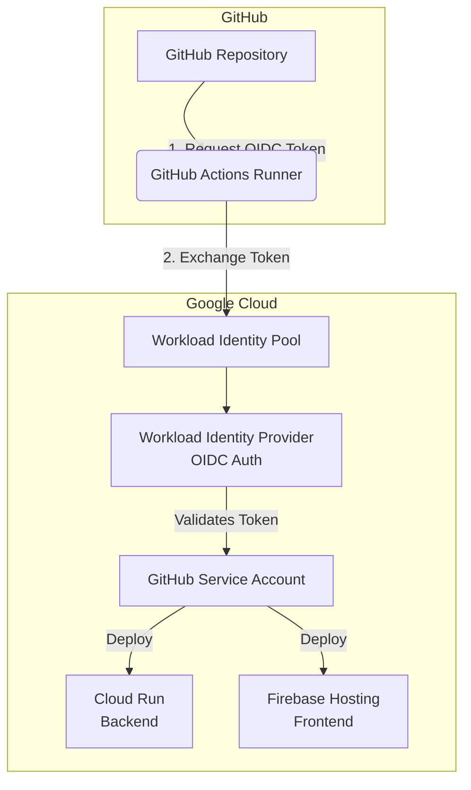

# GitHub Actions & WIF Deployment Guide

> [!NOTE]
> This document is an engineering guide based on the actual implementation and troubleshooting experienced during the setup of the CI/CD pipeline for Source Stream. For a high-level CI/CD overview, refer to [20-ci-cd.md](/docs/20-ci-cd.md). For manual deployment steps, refer to [14-deployment.md](/docs/14-deployment.md).

## Goal
The primary goal of introducing GitHub Actions was to achieve automated, zero-downtime continuous integration and deployment (CI/CD) for both the backend (FastAPI) and frontend (React). 

**Workload Identity Federation (WIF)** was chosen instead of generating and downloading traditional long-lived Service Account JSON keys. The advantages of WIF include:
- **Zero-Trust Security:** No long-lived credentials are ever downloaded, stored in GitHub, or transmitted over the network.
- **Short-Lived Tokens:** WIF issues temporary OpenID Connect (OIDC) tokens that expire automatically.
- **Reduced Attack Surface:** Even if the GitHub repository is compromised, there are no static keys to steal.

Both backend and frontend workflows authenticate using this same WIF OIDC mechanism, impersonating a dedicated GitHub deployment Service Account inside Google Cloud to perform the deployment.

---

## Architecture

**Architecture Components:**
- **GitHub Repository:** The source of truth containing the application code and workflow YAML files.
- **GitHub Actions Runner:** The compute environment that executes the build and deployment scripts.
- **OIDC Authentication:** GitHub issues a JWT (JSON Web Token) to the runner, verifying its identity (repository, branch).
- **Workload Identity Pool/Provider:** A Google Cloud resource configured to trust GitHub's OIDC issuer. It validates the GitHub token.
- **GitHub Service Account:** A standard Google Cloud Service Account. The Workload Identity Provider is granted permission to impersonate this account (`roles/iam.workloadIdentityUser`).
- **Cloud Run / Firebase Hosting:** The final deployment targets. The Service Account requires specific IAM permissions to deploy to these services.

---

## Backend Workflow

The backend CI/CD pipeline (`backend-cicd.yml`) executes the following steps:

1. **Checkout:** Uses `actions/checkout@v4` to pull the source code onto the runner.
2. **Install `uv`:** Installs the fast Python package manager to speed up environment creation.
3. **Python Setup:** Uses `actions/setup-python@v5` targeting Python 3.12 (the baseline requirement dictated by `numpy` and other dependencies).
4. **Dependency Installation:** Uses `uv` to create a virtual environment and install dependencies from `requirements.txt`.
5. **Create mock `.env` file:** Pydantic `BaseSettings` strictly expects API keys. We write real GitHub Secrets into a physical `.env` file so that `pytest` can successfully initialize the FastAPI router and run integration tests against live LLMs.
6. **Running tests:** Executes `uv run pytest`. This acts as a CI gate—if tests fail, deployment halts.
7. **Google Auth:** Uses `google-github-actions/auth@v2` with WIF. It exchanges the GitHub OIDC token for Google Cloud credentials.
8. **Set up Cloud SDK:** Installs `gcloud` CLI tools.
9. **Cloud Run deployment:** Executes `gcloud run deploy source-stream-backend --source .`. 
    - *Why `--source .`?* This abstracts away Dockerfile management. Under the hood, this command triggers **Cloud Build** to containerize the application, pushes the image to **Artifact Registry**, and then deploys it to **Cloud Run**.

---

## Frontend Workflow

The frontend CI/CD pipeline (`frontend-cicd.yml`) executes the following steps:

1. **Checkout:** Uses `actions/checkout@v4` to pull the code.
2. **Node Setup:** Installs Node.js to build the React application.
3. **Dependency Installation:** Runs `npm ci` for a clean, deterministic installation based on `package-lock.json`.
4. **React Build:** Runs `npm run build` using Vite. This bundles the application into static files in the `dist/` directory.
5. **Google Auth:** Uses the exact same `google-github-actions/auth@v2` WIF setup as the backend to authenticate.
6. **Install Firebase CLI:** Installs `firebase-tools` globally so the runner can execute deployment commands.
7. **Firebase Hosting deployment:** Runs `firebase deploy --only hosting --project <project-id>` directly via the CLI. The Firebase CLI automatically detects the WIF credentials provided by the Auth step and uploads the `dist/` folder to Firebase Hosting.

---

## Google Cloud Configuration

To make WIF work, several manual configurations were required in the Google Cloud Console:

1. **Creating the Service Account:** A dedicated service account (`github-actions-deployer@...`) was created purely for CI/CD deployments.
2. **Assigning IAM Roles:** Roles were attached to this Service Account to grant it permissions to deploy to Cloud Run and Firebase (see IAM Roles table below).
3. **Creating the Workload Identity Pool:** A pool was created to group identity providers.
4. **Creating the OIDC Provider:** A provider was added to the pool, pointing to `https://token.actions.githubusercontent.com`.
5. **Repository Restriction:** An attribute condition was applied (`attribute.repository == "theravirai/source-stream"`) to ensure only this specific GitHub repository could authenticate.
6. **Granting Workload Identity User:** The Workload Identity Pool was granted the `roles/iam.workloadIdentityUser` role on the Service Account, creating the binding that allows impersonation.
7. **Adding GitHub Secrets:** The Workload Identity Provider ID and the Service Account email were saved as secrets in GitHub to be referenced in the workflows.

---

## GitHub Repository Configuration

The following Repository Secrets are required in GitHub (`Settings -> Secrets and variables -> Actions`):

| Secret Name | Description | Where it is used |
|-------------|-------------|-------------------|
| `GCP_WORKLOAD_IDENTITY_PROVIDER` | The full path to the WIF provider (e.g., `projects/123/locations/global/workloadIdentityPools/github/providers/my-repo`). | Both workflows (`auth@v2` step). |
| `GCP_SERVICE_ACCOUNT` | The email of the dedicated deployment Service Account. | Both workflows (`auth@v2` step). |
| `GROQ_API_KEY`, `GEMINI_API_KEY`, etc. | Production API keys for LLM and Vector Store services. | Injected into `.env` during backend `pytest` runs. |

---

## IAM Roles

The Service Account ultimately required the following exact IAM roles to successfully deploy both the backend and the frontend. 

> [!IMPORTANT]
> The backend deployed successfully before the frontend because Cloud Run and Firebase Hosting operate on completely different permission models within Google Cloud. API Keys Viewer and Firebase Hosting Admin were only added after deployment errors indicated they were required.

| Role Name | Why it is required | Dependency | Missing Error |
|-----------|--------------------|------------|---------------|
| **Cloud Run Source Developer** | Bundles permissions to upload source code, trigger Cloud Build, and write to Artifact Registry. | Backend | `Permission Denied` on Cloud Run. |
| **Service Account User** | Allows the deployer to attach the default compute identity to the running Cloud Run container. | Backend | `Permission iam.serviceAccounts.actAs denied.` |
| **Storage Admin** | Allows the CLI to upload the temporary zipped source code to a Google Cloud Storage staging bucket before building. | Backend | `storage.buckets.get denied` on `run-sources-*` bucket. |
| **Firebase Hosting Admin** | Grants permission to create releases and upload files to Firebase Hosting. | Frontend | `HTTP Error: 403, The caller does not have permission` |
| **API Keys Viewer** | Allows the Firebase CLI to resolve project configurations during deployment. | Frontend | `HTTP Error: 403` on API key fetch. |
| **Workload Identity User** | Enables GitHub Actions to impersonate this Service Account via OIDC. | Both | Auth failure during `google-github-actions/auth@v2` |

*(Note: `Cloud Run Admin`, `Cloud Build Editor`, and `Artifact Registry Writer` are generally superseded by `Cloud Run Source Developer`, but may be kept as fallbacks).*

---

## Troubleshooting Log (Problems Encountered)

This section documents the actual engineering hurdles faced during implementation.

### 1. Pytest Integration Test Crashes
**Problem:** The backend workflow failed during the `Run Pytest` step with `ValueError: GROQ_API_KEY is not configured in settings`.
**Cause:** Pydantic `BaseSettings` attempts to validate API keys on startup. Because GitHub Actions is a clean environment, it lacked a `.env` file. Providing dummy keys via the `env:` block resulted in HTTP 401 errors because `pytest` executes actual LangChain integrations that hit the Groq/Gemini APIs.
**Solution:** Added a step to securely write the actual GitHub Secrets into a physical `.env` file right before running `uv run pytest`.

### 2. Cloud Run Permission Denied
**Problem:** The deployment step failed with `ERROR: (gcloud.run.deploy) PERMISSION_DENIED: The caller does not have permission.`
**Cause:** Workload Identity Federation successfully logged in, but the impersonated Service Account lacked IAM permissions to deploy to Cloud Run.
**Solution:** Granted `roles/run.sourceDeveloper` and `roles/iam.serviceAccountUser` to the Service Account.

### 3. Cloud Storage Staging Bucket Error
**Problem:** The backend deployment failed with `Permission 'storage.buckets.get' denied on resource '//storage.googleapis.com/projects/_/buckets/run-sources-...'`.
**Cause:** `gcloud run deploy --source .` uses Cloud Build under the hood, which requires uploading the source code to a temporary GCS bucket (`run-sources-*`). The Service Account lacked storage access.
**Solution:** Granted `roles/storage.admin` to the Service Account.

### 4. Firebase Hosting 403 Error
**Problem:** The frontend deployment failed with `HTTP Error: 403, The caller does not have permission` on `https://firebasehosting.googleapis.com/...`.
**Cause:** The Service Account had all necessary Cloud Run permissions but lacked Firebase-specific permissions.
**Solution:** Granted `roles/firebasehosting.admin` and `roles/serviceusage.apiKeysViewer` to the Service Account.

---

## Lessons Learned

1. **Read IAM Errors Carefully:** Instead of assigning primitive `Owner` or `Editor` roles, read the specific resource failing (e.g., `storage.buckets.get`) to apply the Principle of Least Privilege.
2. **One Service Account is Sufficient:** A single, well-scoped Service Account can successfully handle both backend (Cloud Run) and frontend (Firebase) deployments.
3. **WIF > JSON Keys:** Workload Identity Federation is vastly superior and more secure than managing JSON keys, but it requires careful OIDC pool configuration up front.
4. **Cloud Run Source Deployment Abstractions:** `gcloud run deploy --source .` is a powerful abstraction, but it hides the fact that it internally relies heavily on Cloud Storage, Cloud Build, and Artifact Registry. You must provision IAM roles for all three of those hidden services.
5. **Separate Permission Models:** Google Cloud (Cloud Run) and Firebase (Hosting) require completely different IAM permissions. Fixing IAM for the backend does not fix it for the frontend.

---

## Future Projects Checklist

Use this chronological checklist when setting up CI/CD via WIF for future Google Cloud projects:

- [ ] Create a dedicated deployment Service Account in Google Cloud.
- [ ] Create a Workload Identity Pool and an OIDC Provider for GitHub (`https://token.actions.githubusercontent.com`).
- [ ] Restrict the OIDC Provider to your specific GitHub repository.
- [ ] Bind the Workload Identity Pool to the Service Account (`Workload Identity User`).
- [ ] Add `GCP_WORKLOAD_IDENTITY_PROVIDER` and `GCP_SERVICE_ACCOUNT` to GitHub Secrets.
- [ ] Add integration testing secrets (e.g., `GROQ_API_KEY`) to GitHub Secrets.
- [ ] Grant **Cloud Run** Roles: `Cloud Run Source Developer`, `Service Account User`, `Storage Admin`.
- [ ] Grant **Firebase** Roles: `Firebase Hosting Admin`, `API Keys Viewer`.
- [ ] Write GitHub Action workflows utilizing `google-github-actions/auth@v2` with `permissions: id-token: 'write'`.
- [ ] Ensure integration tests are provided with valid environment variables during CI.
