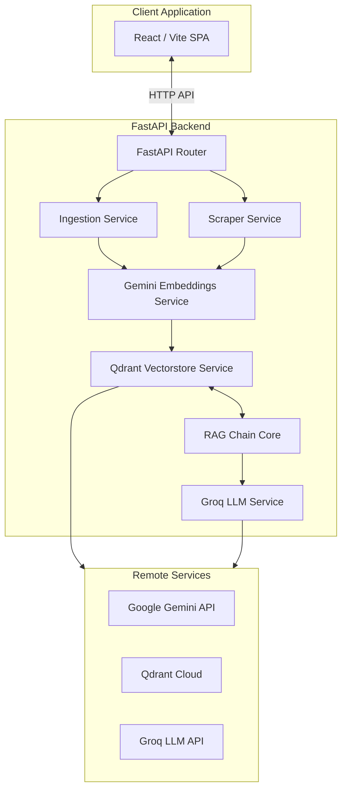

# Architecture

This document describes the high-level architecture of `source-stream`.

## Architecture Diagram

## Modular Responsibilities

- **FastAPI router (`backend/app/api/routes`)**: Entrypoints and CORS configurations. Only validates requests/responses, delegating actual process flows to services.
- **Ingestion service (`backend/app/services/ingestion`)**: Handles chunking of local files (like PDFs) and coordinates pipeline embedding.
- **Scraper service (`backend/app/services/scraper`)**: Connects to external documentation hosts, parsing pages to clean text representation.
- **Embeddings / Vector database (`backend/app/services/vectorstore`)**: Packages embeddings generation (Gemini) and indexes document chunks into Qdrant Cloud.
- **RAG core (`backend/app/services/rag_chain`)**: Coordinates retrieving matching citations, formulating final prompts, and invoking Groq to deliver answers with precise source metadata.
