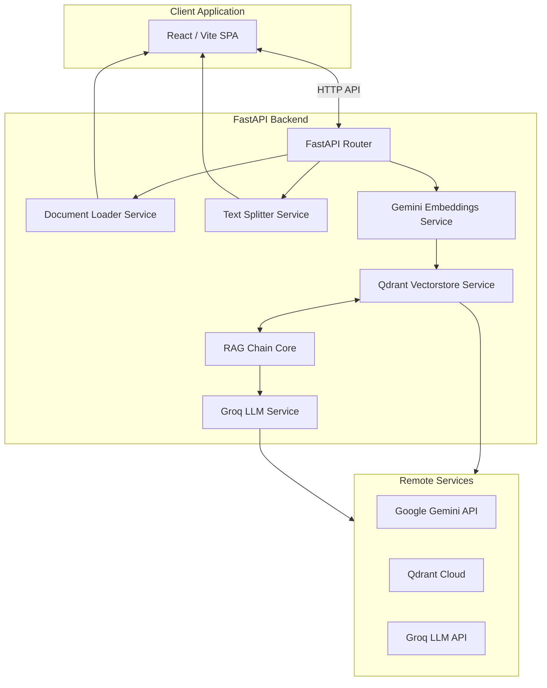

# Architecture

This document describes the high-level architecture of `source-stream`.

## Architecture Diagram

## Stepwise Ingestion & Data Flow

`source-stream` utilizes a decoupled, step-by-step ingestion pipeline designed to allow inspectability at each stage:

1. **Step 1: Document Loading**
   - The user selects a source (Text file, PDF, or website URL) on the Vite React client.
   - The client invokes the corresponding endpoint (`/api/v1/document-loader/...`).
   - The router delegates to the **Document Loader Service** (`app/services/document_loader`), which loads the contents using the appropriate LangChain loader (`TextLoader`, `PyPDFLoader`, or `RecursiveUrlLoader`) and returns a list of loaded `Document` objects with metadata.
   - The client stores these documents in its state.

2. **Step 2: Text Chunking (Splitting)**
   - The client takes the loaded documents from state and presents customization controls (chunk size and overlap).
   - When the user triggers splitting, the client calls `/api/v1/text-splitter/split` with the documents and configurations.
   - The router delegates to the **Text Splitter Service** (`app/services/text_splitter.py`), which instantiates `RecursiveCharacterTextSplitter` to segment the documents and appends sequential `chunk_index` numbers to each chunk's metadata.
   - The split chunks are returned to the client and stored in the client state.

3. **Step 3: Embeddings & Vector Storage**
   - The client takes the split chunks from state and presents an indexing control interface.
   - When the user triggers indexing, the client calls `/api/v1/vector-store/index` with the chunks.
   - The router delegates to the **Vector Store Service** (`app/services/vectorstore.py`), which uses the **Embeddings Service** (`app/services/embeddings.py`) to generate Google Gemini embeddings (`models/gemini-embedding-001`).
   - The vectors are indexed into Qdrant Cloud.
   - The client can also run semantic test queries against the `/api/v1/vector-store/search` endpoint to retrieve matching chunks with similarity scores.

 4. **Step 4: RAG Query & LLM Synthesis**
   - The user interacts with the flat, developer-focused chat interface to ask natural language questions.
   - The client invokes `/api/v1/retriever/query`.
   - The backend retrieves relevant document chunks from Qdrant, dynamically injects similarity scores, and invokes the RAG chain composed using LangChain's LCEL Runnables.
   - The Groq API LLM synthesizes a grounded answer based on the provided context. If the LLM determines the chunks do not contain the answer, it responds deterministically, and the backend routes the chunks to `retrieved_candidates` instead of `source_documents`.
   - The client renders the response along with inline citations (if relevant) or an optional candidates viewer (if irrelevant) and a details drawer for source inspection.

---

## Modular Responsibilities

- **FastAPI router (`backend/app/api/routes/`)**: Receives, validates, and handles HTTP requests. Delegates operational work directly to services and returns standard Pydantic models.
- **Document Loader Service (`backend/app/services/document_loader/`)**: Encapsulates loaders for text, PDFs, and websites, converting them to standard LangChain document structures.
- **Text Splitter Service (`backend/app/services/text_splitter.py`)**: Manages character-based recursive chunking logic and handles document chunk indexes.
- **Embeddings Service (`backend/app/services/embeddings.py`)**: Instantiates Google Gemini Embeddings.
- **Vector Store Service (`backend/app/services/vectorstore.py`)**: Connects to Qdrant Cloud, manages vector collection verification/recreation, indexes chunks, and performs similarity searches.
- **LLM Service (`backend/app/services/llm.py`)**: Instantiates ChatGroq for answer synthesis.
- **RAG Core (`backend/app/services/rag_chain.py`)**: Combines Qdrant VectorStoreRetriever and ChatGroq using LCEL pipeline composition to produce structured query response formats.
