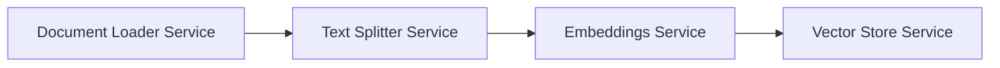

# Project Structure & Architecture Guide

This document provides a detailed breakdown of the `source-stream` directory layout, explaining the purpose of each directory and the specific architectural responsibilities of the backend services.

---

## 📂 Repository Directory Layout

The workspace is organized as a decoupled, monorepo-style setup containing independent client and server applications:

```
source-stream/
├── backend/                 # FastAPI server codebase
│   ├── app/                 # FastAPI core application code
│   │   ├── api/             # API routing, controllers, and dependency injection
│   │   ├── core/            # System-wide configuration, logging, and constants
│   │   ├── models/          # Pydantic schemas representing request/response payloads
│   │   ├── services/        # Decoupled business logic, pipeline services, and utilities
│   │   └── tmp/             # Temporary storage for file uploads
│   └── tests/               # Backend unit and integration test suite
├── docs/                    # High-level architecture, API, and setup documentation
├── frontend/                # Vite + React (JavaScript) client application
│   ├── src/                 # Client source code
│   │   ├── assets/          # Static assets (images, fonts)
│   │   ├── components/      # Modular, reusable UI components
│   │   ├── hooks/           # Custom React hooks (future)
│   │   └── utils/           # Frontend client utility functions
│   └── package.json         # Node.js dependencies and script configurations
├── .env.example             # Template for local environment variables
├── README.md                # General project overview and running instructions

```

---

## 🔌 Backend Folder Structure (`backend/app/`)

Adhering to clean architecture and separation of concerns, the backend is organized into layers:

### 1. `api/` (Routing Layer)
Handles HTTP request ingestion, validation, and serialization. It delegates all operational/business logic to the service layer and returns Pydantic models.
* **`api/routes/health.py`**: Monitors system health, current UTC time, and service uptime.
* **`api/routes/document_loader.py`**: Directs file uploads (text/PDF) and web crawler requests to the loader service.
* **`api/routes/text_splitter.py`**: Manages document chunking parameters (chunk size/overlap).
* **`api/routes/vector_store.py`**: Handles indexing vectors into Qdrant and running retrieval queries.

### 2. `core/` (Core Configuration)
Global settings and setups that affect the entire application execution lifecycle.
* **`core/config.py`**: Loads environment variables from `.env` or system variables using Pydantic Settings.
* **`core/logging.py`**: Sets up standardized JSON/structured log formatters.

### 3. `models/` (Data Models / Schemas)
Defines strict API contracts. Pydantic models validate input parameters and define output structures.
* **`models/document_loader.py`**: Standardizes request formats for websites and structures loaded document outputs.
* **`models/text_splitter.py`**: Enforces strict overlap constraints (`chunk_overlap < chunk_size`).
* **`models/vector_store.py`**: Standardizes payloads for indexing and similarity search results.

### 4. `services/` (Business Logic Layer)
The engine of the pipeline. Services are self-contained classes or functions that handle standard LangChain API operations and processing without touching HTTP routers directly.

---

## 🛠 Backend Services & Responsibilities

The ingestion pipeline is designed around the **Single Responsibility Principle**. Each service handles exactly one step in the pipeline.



### 1. Document Loader Service (`app/services/document_loader/`)
* **Purpose**: Parse raw files and external web documents into LangChain-compatible lists of `Document` records.
* **Key Files**:
  * `loader.py`: Central orchestrator that inspects file extensions/types and delegates to specific loaders.
  * `text_loader.py`: Uses LangChain's `TextLoader` to load plain text (`.txt`) documents.
  * `pdf_loader.py`: Uses LangChain's `PyPDFLoader` to parse local multi-page PDF documents.
  * `website_loader.py`: Uses LangChain's `RecursiveUrlLoader` to spider web pages within a domain and extract clean textual layouts.

### 2. Text Splitter Service (`app/services/text_splitter.py`)
* **Purpose**: Split large blocks of text into smaller, overlapping segments suitable for LLM context limits and semantic vector resolution.
* **Responsibility**:
  * Instantiates LangChain's `RecursiveCharacterTextSplitter`.
  * Computes clean segments.
  * Enriches the chunk's `metadata` with sequential indexing flags (`chunk_index`), preserving context provenance.

### 3. Embeddings Service (`app/services/embeddings.py`)
* **Purpose**: Provide access to embedding generation APIs.
* **Responsibility**:
  * Configures and creates the `GoogleGenerativeAIEmbeddings` class using `models/gemini-embedding-001`.
  * Standardizes embedding dimensions dynamically for database validation.

### 4. Vector Store Service (`app/services/vectorstore.py`)
* **Purpose**: Handle all direct operations with Qdrant.
* **Responsibility**:
  * Manages the connection pool using `QdrantClient`.
  * Validates the schema of the configured collection (recreating the collection if the dimension changes or does not exist).
  * Indexes (upserts) embedding vectors with corresponding page contents and source metadata.
  * Runs similarity searches returning matching documents and Cosine scores.
