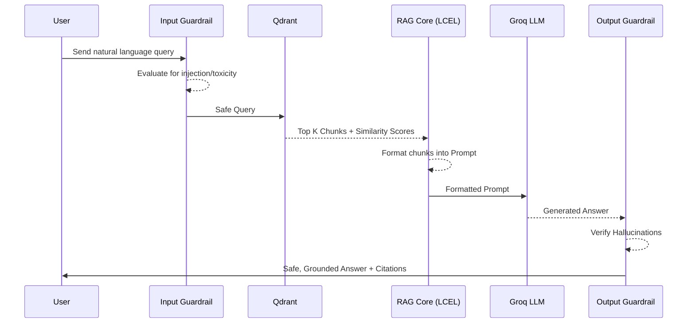

# Retrieval Pipeline

This document explains the runtime data flow during a user query.

**Question:** What happens from user query to grounded response?

## Pipeline Overview

The retrieval pipeline executes in a strict sequence to ensure safety, relevance, and accuracy.

## Phase Breakdown

### 1. Input Guardrail Execution
Before any retrieval occurs, the query is passed to an LLM-as-a-judge (the Guardrail Service). This checks for malicious instructions (prompt injection) or off-topic requests. If the query is flagged, the pipeline halts immediately and returns a safe fallback message.

### 2. Semantic Retrieval
The query is embedded using Google Gemini's embedding model. This dense vector is passed to Qdrant Cloud to perform an Approximate Nearest Neighbor (ANN) search using the HNSW algorithm. Qdrant returns the Top K document chunks that are semantically similar to the query, along with their Cosine Similarity scores.

### 3. Prompt Construction & Synthesis
The returned chunks are serialized and injected into a strict prompt template alongside the user's original query. This combined payload is sent to the Groq LLM. The LLM is instructed to answer *only* based on the provided context.

### 4. Output Evaluation (Hallucination Check)
Before the response is returned to the user, a secondary Guardrail check evaluates the generated answer against the retrieved context. If the LLM fabricated information not found in the chunks, the output is suppressed and replaced with a fallback statement.

## Cross-References
- To see how the system handles queries where context doesn't have the answer, see [query-routing.md](query-routing.md).
- To understand how the context is actually injected, see [prompt-construction.md](prompt-construction.md).
